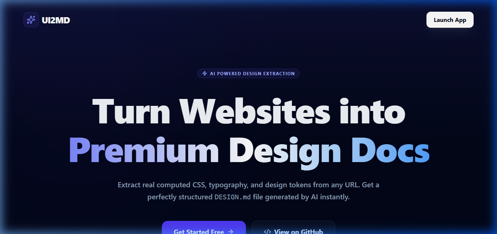

<div align="center">

# ✨ UI2MD

**Extract computed CSS design tokens from any website and generate a premium `DESIGN.md` file — powered by Puppeteer and Google Gemini AI.**

[](https://ui2md.vercel.app)
[](LICENSE)
[](https://nodejs.org)



</div>

---

## 🚀 What is UI2MD?

**UI2MD** is a professional-grade SaaS tool designed for developers and agencies to extract real design frameworks from any URL. It launches a headless browser, scrapes real computed CSS (not just source code), and uses **Google Gemini 1.5 Flash** to synthesize a perfectly structured `DESIGN.md` documentation.

> **Zero Server Costs. Zero Stored Data.** UI2MD operates on a **BYOK (Bring Your Own Key)** model, ensuring your credentials and privacy remain entirely yours.

---

## ✨ Key Features

- 🌐 **Any Website Analysis**: Scrape real-time computed styles from any public URL.
- 💎 **Premium Landing Page**: A modern, glassmorphism-themed marketing site to guide users.
- 🤖 **Gemini AI Engine**: Intelligent parsing that converts raw CSS into human-readable design tokens.
- 🔐 **BYOK Architecture**: Your Gemini API keys are stored only in your local browser storage (**localStorage**) and used directly from your client.
- 📄 **Markdown Export**: Direct "Copy to Clipboard" or "Download .md" functionality for your documentation.
- ⚖️ **Legal Compliance**: Built-in Privacy Policy and Terms of Service focusing on your data rights.

---

## 🛠️ Tech Stack

| Layer | Technology |
|---|---|
| **Frontend** | React 19, Vite, Tailwind CSS, **React Router**, Lucide Icons |
| **Serverless API** | Vercel Serverless Functions (Node.js) |
| **Scraping** | Puppeteer-Core + @sparticuz/chromium |
| **AI Generation** | Google Gemini 1.5 Flash |
| **Database** | Supabase (PostgreSQL) - Ready for persistence |
| **Deployment** | Vercel |

---

## 🔐 BYOK Security (Bring Your Own Key)

UI2MD is designed to be **server-less** in terms of data storage. 

1. **Local Storage**: Your API key is saved in your browser's `localStorage` as `userGeminiKey`.
2. **Direct Requests**: When you trigger an extraction, the frontend sends this key via the `x-gemini-key` header to our serverless proxy.
3. **No Database Logs**: We never save or log your API keys on our servers.

---

## 📂 Project Structure

```bash
ui2md/
├── api/
│   └── scrape.js          # Core Serverless Engine (Puppeteer + AI)
├── assets/                 # Documentation assets & screenshots
├── frontend/
│   ├── src/
│   │   ├── App.jsx        # Unified Route Manager
│   │   ├── LandingPage.jsx # Marketing Page (/)
│   │   ├── ExtractorApp.jsx # Core Tool Interface (/app)
│   │   ├── PrivacyPolicy.jsx # Data Privacy Page (/privacy)
│   │   ├── TermsOfService.jsx # Legal Terms Page (/terms)
│   └── index.css          # Tailwind Design System
├── database.sql            # Supabase schema for persistence
└── vercel.json             # Deployment configuration
```

---

## ⚙️ Local Development Setup

### 1. Clone the repository

```bash
git clone https://github.com/Faahad0412/ui2md.git
cd ui2md
```

### 2. Install Dependencies

```bash
npm install          # Root serverless dependencies
cd frontend
npm install          # React frontend dependencies
cd ..
```

### 3. Set Up Environment

Create `.env` in `frontend/`:
```env
VITE_API_URL=http://localhost:3001
```

### 4. Run Locally

**Terminal 1 (Backend):**
```bash
# Uses local Chrome to scrape
node dev-server.js
```

**Terminal 2 (Frontend):**
```bash
cd frontend
npm run dev
```

---

## ☁️ Deployment

UI2MD is optimized for **Vercel**.

1. **Import** the repo to Vercel.
2. Ensure **Build Command** is `cd frontend && npm install && npm run build`.
3. Set **Output Directory** as `frontend/dist`.
4. Deploy! No environment variables are required on Vercel if you use the BYOK model.

---

## 🗺️ Roadmap

- [x] Puppeteer CSS extraction
- [x] Gemini AI Markdown generation
- [x] BYOK Security Model
- [x] Marketing Landing Page
- [x] Legal Pages (Privacy & Terms)
- [ ] User Extraction History (Supabase)
- [ ] Dark/Light Mode toggle
- [ ] PDF Export for DESIGN.md

---

## 📄 License

Distributed under the MIT License. See `LICENSE` for more information.

Developed with ✨ by [Faahad0412](https://github.com/Faahad0412)
